# Audit ledger — catbus @ `d6540d5f06e7`

Root `d499407b5f97532e30208acafed2ce66825a6c09a8a48c57eb3633c379ec48c9` · started 2026-09-05T05:50:00Z · dimensions: readme-vs-code, ci-and-badges

**17 findings** · 1 confirmed · 1 corrected · 0 refuted · 15 unverified · 1 superseded by corrections

Every row below is a content-addressed node in the audit DAG. A verdict is a
typed edge from a verification node that is itself grounded in captured
evidence. Nothing here was edited after the fact: corrections are new nodes
that supersede the originals, and the originals stay addressable.

## readme-vs-code

1. **OVERSTATING/medium** (CONFIRMED) — README.md:63-66 "Enforce Handoffs ... For strict enforcement, wrap agent execution with scripts/catbus-guard.sh" and README.md:71-72 (CATBUS_CID=... ./scripts/catbus-guard.sh -- your-agent-command / catbus guard --cid <cid> -- your-agent-command)
   - evidence: scripts/catbus-guard.sh:31-35 runs `catbus validate "$cid" >/dev/null`, then `catbus handoff "$cid"` (printed to the wrapper's stdout), then `exec "$@"`. src/main.rs:694-710 (cmd_guard) does the same: validate, print block, `std::process::Command::new(&args.cmd[0]).status()` with inherited stdio. Nothing is passed to the agent command: no env var, no stdin, no file. The only thing 'enforced' is that the CID resolves and the packet's summary is non-blank (validate_packet, src/main.rs:919-953). Whether the agent consumed the handoff is never checked; the 'rules' lines (src/main.rs:537-539) are prose. The shell script also calls a `catbus` binary on PATH while every other README example uses `cargo run --`.
   - verification evidence `2f292b4d78aa`:

     scripts/catbus-guard.sh:31-35: `catbus validate "$cid" >/dev/null` / `catbus handoff "$cid"` / `if [[ "$#" -gt 0 ]]; then exec "$@"; fi` — handoff text goes to the wrapper's own stdout, then the command is exec'd with no argument, file, or stdin derived from the packet. src/main.rs:680-716 (cmd_guard): cmd_validate(...)?; cmd_handoff(...)? (which at src/main.rs:504 does `print!("{}", render_handoff(...))` to catbus's stdout); then `std::process::Command::new(&args.cmd[0])` + `.args(&args.cmd[1..])` + `.status()`. Grep for `\.env\(|\.stdin\(|\.stdout\(` in src/ returns no matches, so nothing is injected into the child; the exit status is merely propagated (src/main.rs:711-715). Enforcement scope: validate_packet src/main.rs:919-953 checks only catbus_packet meta == "true", non-blank summary, optional --require-artifacts/--require-cdom, and cdom format string; nothing inspects the agent's behaviour. The 'rules' are static strings: src/main.rs:537-539 `out.push_str("rules:\n"); ... "- do not recompute context already in this handoff\n"`. Grep for `guard` across the repo (excluding target/) finds no tests or CI exercising guard — only src/main.rs:252,680-716, README.md:66-72, and the script. README.md:19-25,38-45,55,69-70,88-89 all use `cargo run --`; only README.md:72 and the script (lines 31-32) invoke a bare `catbus` on PATH, and the README has no `cargo install` line. Minor nuance not affecting the verdict: when CATBUS_CID is supplied via the environment (README.md:71), the exec'd/spawned child inherits that variable by normal process inheritance, so the agent can technically see the CID; but neither path passes the handoff content, and the `--cid` form (README.md:72) sets nothing at all. 'Strict enforcement' therefore amounts to a pre-flight validity check plus printing a block to the terminal; whether the agent consumed the handoff is never checked.

   - node `503cb7bd484bc7da096697d8a5f2d3a6fe4c7b091d55fab537e3046078e671af`

2. **VACUOUS/medium** (CORRECTED) — README.md:64 "Use `catbus validate` to ensure packets meet requirements" — OVERSTATING (not VACUOUS), severity low-medium. validate_packet (src/main.rs:919-953) only checks node meta catbus_packet==true, non-blank summary, optional --require-artifacts/--require-cdom, and cdom.format=='catbus.cdom.v1'; it never verifies that artifact CIDs, the CDOM CID, or parent CIDs resolve in the CAS. For packets produced by `catbus pack` (which sets the meta unconditionally at src/main.rs:301 and :330 and always writes format 'catbus.cdom.v1' at :306), the flagless form used by scripts/catbus-guard.sh:31 reduces to 'CID resolves to a parseable packet node and summary is not blank'. However the check is not unfalsifiable: cmd_validate (src/main.rs:652-660) fails on a nonexistent CID, a CID that is not a DAG node, or a node whose output is not HandoffPacket JSON (get_node / load_packet errors); clap's required `--summary` accepts an empty string so `pack --summary ""` produces a packet that flagless validate rejects; and the README's own example at line 69 uses `--require-artifacts`, a check that genuinely fails on artifact-less packets. The unit test validation_report_errors (src/main.rs:1120-1137) only covers the with-flags path; there is no tests/ directory or integration test for the flagless path.
   - evidence: validate_packet (src/main.rs:919-953) checks four things: node meta catbus_packet==true, summary non-blank, optional --require-artifacts / --require-cdom, and cdom.format string. Any packet made by `catbus pack` sets the meta unconditionally (src/main.rs:301, 330) and clap makes --summary a required String (src/main.rs:71-73), so a default `catbus validate <cid>` (the form catbus-guard.sh:31 uses) can only fail on an all-whitespace summary. It does not check that artifact CIDs, the CDOM CID, or parent CIDs exist in the CAS. The unit test validation_report_errors (src/main.rs:1120-1137) exercises only the with-flags path.
   - supersedes `05e1c222aea6`
   - verification evidence `89d3b5bbfd9a`:

     README.md:64-69: "Use `catbus validate` to ensure packets meet requirements, and `catbus handoff`\n... cargo run -- validate <node-cid> --require-artifacts". scripts/catbus-guard.sh:31: `catbus validate "$cid" >/dev/null` (no flags). src/main.rs:71-73: `/// Required summary (keep it short)\n#[arg(long)]\nsummary: String,` (required but accepts ""). src/main.rs:301: `meta.insert("catbus_packet".into(), "true".into());` src/main.rs:330: `.with_meta("catbus_packet", "true");` src/main.rs:306: `format: "catbus.cdom.v1".to_string(),`. src/main.rs:652-660: `let node = dag.get_node(&Cid::from(args.cid.as_str())).context("get node")?; let packet = load_packet(&cas, &node)?; let report = validate_packet(&node, &packet, args.require_artifacts, args.require_cdom);` — these `?` paths make the command fail on bad/non-packet CIDs. src/main.rs:789-793 load_packet: `let bytes = cas.get(&node.output_cid)?; let packet: HandoffPacket = serde_json::from_slice(&bytes)?;` — fetches only output_cid, never artifact/cdom/parent CIDs. src/main.rs:919-953 validate_packet: checks catbus_packet meta, `packet.summary.trim().is_empty()`, require_artifacts && artifacts.is_empty(), require_cdom && cdom.is_none(), cdom.format != "catbus.cdom.v1"; no CAS access. src/main.rs:1120-1137 validation_report_errors: `validate_packet(&node, &packet, true, true)` only. `ls tests` -> no such directory; `grep -rn validate tests/ docs/` -> no output.

   - node `1dd575fdee89bbb52fe2772c86bdb7fcc9afd704bef0c79f248ac743f0c6edaa`

3. **HONEST/low** (unverified) — README.md:13 "Immutable handoff packets with provenance (linked in the ket DAG)" and README.md:51-52 parents let the consuming model "walk lineage (`ket dag lineage`)"
   - evidence: Storage is content-addressed BLAKE3 (ket-cas v0.3.0 src/lib.rs:3, :53-54); the node is a DagNode with parents (src/main.rs:327-331); render_handoff prints parents (src/main.rs:517-522, tested at :1095-1118); ket-cli has `dag lineage` (ket-cli/src/main.rs:594, :1108-1109). However --parent values become CIDs via `Cid::from(p.as_str())` which is a plain string wrap (ket-cas src/lib.rs:46-49) and Dag::put_node just serializes and puts (ket-dag src/lib.rs:369-372); neither pack nor validate checks a parent exists. `catbus pack --parent bogus` succeeds and produces a 'provenance' edge to nothing.
   - node `df1daf597a033f1c56233e1650f47d6504c0b76cc0563f391315ee809d39bbdf`

4. **OVERSTATING/low** (unverified) — README.md:14 "Model-agnostic context transfer via CIDs"; README.md:33 "Store the handoff once, rehydrate it anywhere."; docs/index.html:127-129 "Rehydrate anywhere"
   - evidence: Every command opens `<ket_home>/cas` on the local filesystem (src/main.rs:728-733, :765-768; default `.ket` in cwd). The Command enum (src/main.rs:33-56) has no export/import/push/pull/serve; 'anywhere' means any process with access to the same .ket directory. 'Model-agnostic' is true only in the trivial sense that the tool never talks to a model.
   - node `08e90cf23050d314ca1ceff36f2995ab8b93061b77b6fd1d22b09f8b0a868cb6`

5. **OVERSTATING/low** (unverified) — README.md:15 "Optional CDOM symbol summaries"; README.md:84 "Use `--cdom` to generate a minimal CDOM bundle from provided files/dirs."
   - evidence: collect_scan_files (src/main.rs:1022-1041) keeps only files where ket_cdom::detect_language is Some; at the pinned ket v0.3.0 that is `"rs" => rust, "py" => python, _ => None` (ket-cdom/src/lib.rs:78-84). Other files are silently dropped; if none match, pack errors "no supported files for CDOM scanning" (src/main.rs:965-967). README never states the Rust/Python-only limit. Bundle is stored as a separate CAS blob and referenced by CID (src/main.rs:992-1000) as README.md:85 says.
   - node `33b50b35b6e74fa3e8060f74a54f604e7d5a4f3b269530d0270bba253a4ac6ea`

6. **HONEST/low** (unverified) — README.md:48-61 "How Much It Saves": `catbus stats` prints bytes and ~4 bytes/token estimates; sample shows handoff block 619/155, cdom bundle 10801/2701, artifact dag.rs 31675/7919, "handoff is 51.2x smaller than re-sending the artifacts"
   - evidence: Implemented in cmd_stats (src/main.rs:581-650): BYTES_PER_TOKEN=4 with div_ceil (:546-550, tested :1086-1093); ratio = artifacts_total / handoff_block bytes (:605-609). Sample numbers match the ket demo transcript (/home/nick/code/ket/docs/DEMO.md:143-150) exactly; the README elides the 'packet json' and 'artifacts total' rows the real output prints (:626-644). Caveat: the ratio compares a user-written summary plus pointers against the pointed-to bytes, so it is large whenever artifacts are large regardless of whether the summary preserves anything; the README wording ('smaller than re-sending the artifacts') states exactly what is computed. Could not execute the binary to reproduce (command approval denied).
   - node `ed6339b96a5b661f720810220ee96b8f04c8836b941a76e7a50073a4bca0ca18`

7. **OVERSTATING/low** (unverified) — README.md:98-105 "`Cargo.toml` uses the remote ket repo:" with `ket-cas = { git = "https://github.com/nickjoven/ket", package = "ket-cas" }` etc.
   - evidence: Actual Cargo.toml:20-23 is `git = "https://github.com/nickjoven/ket.git", tag = "v0.3.0"`; Cargo.lock:413-415 resolves to `git+https://github.com/nickjoven/ket.git?tag=v0.3.0#aa30cc16`. The README snippet omits the tag pin and the .git suffix that commit 6158d66 deliberately added ('cargo treats .../ket and .../ket.git as distinct sources'). A reader copying the README snippet would track ket HEAD and, per that commit, could pull ket twice.
   - node `86436e68f9435375c8a5019f8a6d70341fb1dc515efd5e42af42534797897276`

8. **NEUTRAL-FACT/info** (unverified) — Command surface vs README: `gc` and `list`
   - evidence: `catbus gc` is a self-labelled placeholder (src/main.rs:54-55 "noop placeholder", :718-726 prints "gc: noop (not implemented yet)"); it is not advertised in the README, so honest. `catbus list` (README.md:21) is documented in --help as "best effort" (src/main.rs:40): it iterates every CAS blob and tries to decode each as a DagNode (:372-388), which is O(store) and unordered. Cargo.toml:10,13-14 declare `dirs`, `thiserror`, `tokio` which src/ never uses (grep: 0 matches).
   - node `58b7c3ed4f058f6f142b7614ae3ecd25fc3855dde3e25102230ddcbb3e1a21c7`

9. **NEUTRAL-FACT/info** (unverified) — README.md:28-29 link to "the ket + catbus demo" at github.com/nickjoven/ket/blob/main/docs/DEMO.md
   - evidence: /home/nick/code/ket/docs/DEMO.md exists locally and contains the catbus pack/handoff/stats/guard/unpack/diff transcript (lines 111-181) whose output matches this code's formats (render_handoff src/main.rs:511-541; stats table :625-648). Whether it is pushed to ket's main was not verifiable (git command approval denied). DEMO.md:22-23 installs via `cargo install --git`, whereas this README uses `cargo run --` throughout.
   - node `a6be71271500d8a2ab4a606725f5604fbe3b7b53eb4c35b91532c0126169fc17`

10. **NEUTRAL-FACT/info** (unverified) — README.md:92-96 "The example workflow is also published on GitHub Pages: https://nickjoven.github.io/catbus/"
   - evidence: .github/workflows/pages.yml:3-5,30-37 deploys `docs/` on push to main; docs/index.html exists (149 lines, static page mirroring the README example). Live URL not verified (WebFetch denied). Note the current branch handoff-stats is ahead of main (git diff main..HEAD --stat: README +19, main.rs +291), so the published page/README on main predates the stats/parents features.
   - node `b2e1c5b63a2752e4e49919f4b5607222d8cf5f5794ab3d82389391840b6bf25c`

11. **NEUTRAL-FACT/info** (unverified) — Testing / CI posture (README makes no 'tested' claim; commit d6540d5 says "Unit test covers format and heal"; commit 4f9c0c9 says "clippy-clean under -D warnings")
   - evidence: Five unit tests exist in src/main.rs:1043-1138 (cdom bundle generation, append_log format/heal, token rounding, handoff block parents, validation errors); the append_log test (:1071-1084) matches the commit message. No CI runs `cargo test` or clippy: the only workflow is pages.yml. No badges in README. A test binary target/debug/deps/catbus-b26f53e0ce8a481d is dated Sep 4 14:53, same as src/main.rs, but I could not execute it or `cargo test` (approvals denied), so pass/fail is unverified. No tests cover pack/unpack/list/diff/guard end to end.
   - node `2b0b4afd5591de7a5d4db5589ffbbb86724541a2d008f773dfcdb2c1fe7e89e7`

## ci-and-badges

1. **NEUTRAL-FACT/low** (unverified) — Implicit: the repository's 5 unit tests (src/main.rs:1043-1138) are exercised somewhere.
   - evidence: src/main.rs:1043 `#[cfg(test)] mod tests` with 5 `#[test]` fns (lines 1049, 1071, 1086, 1095, 1120). No workflow invokes `cargo test`; pages.yml is the only CI and it never builds the crate. Tests were added in commits 4f9c0c9/d6540d5 (2026-09-04) on branch handoff-stats, which is 3 commits ahead of origin/main (git log origin/main -1 -> 6158d66). Attempted `cargo test --offline` locally; command required interactive approval and could not run, so pass/fail is unverified here. The README makes no claim that tests run, so this is a gap rather than a false statement.
   - node `c7c59b2b71f90d45a6e07c6c53ebac5166c789b4e52cdeb01822fe136d9e0e01`

2. **OVERSTATING/low** (unverified) — README.md:63-66: "For strict enforcement, wrap agent execution with `scripts/catbus-guard.sh`."
   - evidence: scripts/catbus-guard.sh:2 `set -euo pipefail`; :31 `catbus validate "$cid" >/dev/null` (a non-zero exit aborts before the agent runs, so the gate is real, not `|| true`); :32 prints the handoff; :35 `exec "$@"`. However the script calls plain `catbus validate` with no `--require-artifacts`/`--require-cdom`, and validate_packet (src/main.rs:935,939) only checks artifacts/cdom when those flags are set, so by default 'strict' means only 'CID resolves and summary is non-blank'. The script also invokes `catbus` from PATH while every other README example uses `cargo run --`; it fails with command-not-found unless the binary is installed. Nothing verifies the agent actually consumed the handoff or produced a new packet afterwards (README.md:80 asks for that, but the guard cannot check it). The Rust `catbus guard` (src/main.rs:680-716) does forward --require-* flags and propagates the child's exit status.
   - node `2d788b4343c225a631db6901790f01de04a8c0bd5ed5c344bcf3e3d36a065189`

3. **NEUTRAL-FACT/low** (unverified) — README.md:98-105: "`Cargo.toml` uses the remote ket repo:" followed by a snippet with `git = "https://github.com/nickjoven/ket"` and no version pin.
   - evidence: Actual Cargo.toml:20-23 reads `ket-cas = { git = "https://github.com/nickjoven/ket.git", tag = "v0.3.0", package = "ket-cas" }` (and same for ket-dag/ket-sql/ket-cdom). Cargo.lock:415,425,439,452 resolve to `git+https://github.com/nickjoven/ket.git?tag=v0.3.0#aa30cc16...`. The README snippet is stale (predates commits 6158d66 'Pin ket via tag v0.2.0' and d6540d5 'pin ket v0.3.0'). Direction of drift is unflattering (README shows unpinned, code is pinned), so readers are not misled about rigor, only about the literal contents.
   - node `6cebf61965032603196de8579f80d80a201d5f5bf4d45eb00a44fb497967c016`

4. **HONEST/info** (unverified) — Commit messages d6540d5 "pin ket v0.3.0" and 6158d66 "Pin ket via tag v0.2.0; normalize git source URL" describe the dependency pin; 4f9c0c9 "add `catbus stats`".
   - evidence: Cargo.toml:20-23 tag = "v0.3.0" with `.git` URL; Cargo.lock:415 pinned to commit aa30cc16 at tag v0.3.0. `catbus stats` subcommand exists (StatsArgs at src/main.rs:179; README.md:25,55). Commit claims match the tree.
   - node `c438fc520d2bdba3757fc1298bdfacd749775e3dfc57f374f04e987d31c8a150`

5. **NEUTRAL-FACT/info** (unverified) — README shows no CI/test/coverage badges; the only workflow is a GitHub Pages deploy.
   - evidence: grep -in 'badge|shields|actions' README.md docs/index.html -> no matches. .github/workflows/ contains only pages.yml (685 bytes). pages.yml:3-6 triggers on push to main + workflow_dispatch; steps (pages.yml:24-37) are checkout, configure-pages, upload-pages-artifact (path: docs), deploy-pages. No job runs cargo build, cargo test, cargo clippy, or cargo fmt. No Makefile, no other scripts besides scripts/catbus-guard.sh.
   - node `650dde6b4ca1c4bdb423a9c9278728a459a5e33846afd1acf48ce76b3dcf808d`

6. **HONEST/info** (unverified) — README.md:92-96: "The example workflow is also published on GitHub Pages: https://nickjoven.github.io/catbus/"
   - evidence: pages.yml:30-37 uploads `docs` and deploys via actions/deploy-pages@v4; docs/index.html exists (3986 bytes, title 'catbus · Example Workflow', docs/index.html:6). Remote is https://github.com/nickjoven/catbus.git, so the URL matches this repo. Workflow fires only on `main` (pages.yml:5); the current branch handoff-stats is unpushed/ahead, so the published page reflects main's docs, not this branch. Live deployment status could not be confirmed: `gh api repos/nickjoven/catbus/pages` and `gh run list` required approval and were not executed.
   - node `46b43851b6e8ed38995f27f610708447b6a4e2869566ae1d9dab6884ed51bb68`

## Graph

```mermaid
graph BT
  nd499407b5f97["d499407b5f97<br/>context · sieve<br/>{#quot;dimensions#quot;:#91;#quot;readme-vs-code#quot;,#quot;ci-and-badges#quot;#93;…"]
  class nd499407b5f97 context
  n035a109c3b40["035a109c3b40<br/>memory · audit:ci-and-badges<br/>{#quot;duration_api_ms#quot;:126634,#quot;stop_reason#quot;:#quot;end_tur…"]
  class n035a109c3b40 memory
  n650dde6b4ca1["650dde6b4ca1<br/>reasoning · audit:ci-and-badges<br/>{#quot;claim#quot;:#quot;README shows no CI/test/coverage badge…"]
  class n650dde6b4ca1 reasoning
  nc7c59b2b71f9["c7c59b2b71f9<br/>reasoning · audit:ci-and-badges<br/>{#quot;claim#quot;:#quot;Implicit: the repository's 5 unit test…"]
  class nc7c59b2b71f9 reasoning
  n46b43851b6e8["46b43851b6e8<br/>reasoning · audit:ci-and-badges<br/>{#quot;claim#quot;:#quot;README.md:92-96: \#quot;The example workflo…"]
  class n46b43851b6e8 reasoning
  n6cebf6196503["6cebf6196503<br/>reasoning · audit:ci-and-badges<br/>{#quot;claim#quot;:#quot;README.md:98-105: \#quot;#96;Cargo.toml#96; uses …"]
  class n6cebf6196503 reasoning
  n2d788b4343c2["2d788b4343c2<br/>reasoning · audit:ci-and-badges<br/>{#quot;claim#quot;:#quot;README.md:63-66: \#quot;For strict enforcem…"]
  class n2d788b4343c2 reasoning
  nc438fc520d2b["c438fc520d2b<br/>reasoning · audit:ci-and-badges<br/>{#quot;claim#quot;:#quot;Commit messages d6540d5 \#quot;pin ket v0.3…"]
  class nc438fc520d2b reasoning
  ne8c96f9a6671["e8c96f9a6671<br/>memory · audit:readme-vs-code<br/>{#quot;duration_api_ms#quot;:189168,#quot;stop_reason#quot;:#quot;end_tur…"]
  class ne8c96f9a6671 memory
  n503cb7bd484b["503cb7bd484b<br/>reasoning · audit:readme-vs-code<br/>{#quot;claim#quot;:#quot;README.md:63-66 \#quot;Enforce Handoffs ...…"]
  class n503cb7bd484b reasoning
  n05e1c222aea6["05e1c222aea6<br/>reasoning · audit:readme-vs-code<br/>{#quot;claim#quot;:#quot;README.md:64 \#quot;Use #96;catbus validate#96; t…"]
  class n05e1c222aea6 reasoning
  ndf1daf597a03["df1daf597a03<br/>reasoning · audit:readme-vs-code<br/>{#quot;claim#quot;:#quot;README.md:13 \#quot;Immutable handoff packe…"]
  class ndf1daf597a03 reasoning
  n08e90cf23050["08e90cf23050<br/>reasoning · audit:readme-vs-code<br/>{#quot;claim#quot;:#quot;README.md:14 \#quot;Model-agnostic context …"]
  class n08e90cf23050 reasoning
  n33b50b35b6e7["33b50b35b6e7<br/>reasoning · audit:readme-vs-code<br/>{#quot;claim#quot;:#quot;README.md:15 \#quot;Optional CDOM symbol su…"]
  class n33b50b35b6e7 reasoning
  ned6339b96a5b["ed6339b96a5b<br/>reasoning · audit:readme-vs-code<br/>{#quot;claim#quot;:#quot;README.md:48-61 \#quot;How Much It Saves\#quot;:…"]
  class ned6339b96a5b reasoning
  n86436e68f943["86436e68f943<br/>reasoning · audit:readme-vs-code<br/>{#quot;claim#quot;:#quot;README.md:98-105 \#quot;#96;Cargo.toml#96; uses t…"]
  class n86436e68f943 reasoning
  nb2e1c5b63a27["b2e1c5b63a27<br/>reasoning · audit:readme-vs-code<br/>{#quot;claim#quot;:#quot;README.md:92-96 \#quot;The example workflow…"]
  class nb2e1c5b63a27 reasoning
  na6be71271500["a6be71271500<br/>reasoning · audit:readme-vs-code<br/>{#quot;claim#quot;:#quot;README.md:28-29 link to \#quot;the ket + ca…"]
  class na6be71271500 reasoning
  n2b0b4afd5591["2b0b4afd5591<br/>reasoning · audit:readme-vs-code<br/>{#quot;claim#quot;:#quot;Testing / CI posture (README makes no …"]
  class n2b0b4afd5591 reasoning
  n58b7c3ed4f05["58b7c3ed4f05<br/>reasoning · audit:readme-vs-code<br/>{#quot;claim#quot;:#quot;Command surface vs README: #96;gc#96; and #96;l…"]
  class n58b7c3ed4f05 reasoning
  n2f292b4d78aa["2f292b4d78aa<br/>memory · verify:readme-vs-code<br/>scripts/catbus-guard.sh:31-35: #96;catbus validate …"]
  class n2f292b4d78aa memory
  n572538348e7b["572538348e7b<br/>reasoning · verify:readme-vs-code<br/>{#quot;correction#quot;:#quot;#quot;,#quot;verdict#quot;:#quot;CONFIRMED#quot;}"]
  class n572538348e7b reasoning
  n89d3b5bbfd9a["89d3b5bbfd9a<br/>memory · verify:readme-vs-code<br/>README.md:64-69: #quot;Use #96;catbus validate#96; to ensur…"]
  class n89d3b5bbfd9a memory
  n1dd575fdee89["1dd575fdee89<br/>reasoning · verify:readme-vs-code<br/>{#quot;claim#quot;:#quot;README.md:64 \#quot;Use #96;catbus validate#96; t…"]
  class n1dd575fdee89 reasoning
  n5a48866ed54a["5a48866ed54a<br/>reasoning · verify:readme-vs-code<br/>{#quot;correction#quot;:#quot;README.md:64 \#quot;Use #96;catbus valida…"]
  class n5a48866ed54a reasoning
  n035a109c3b40 --> nd499407b5f97
  n650dde6b4ca1 -.->|proposes| nd499407b5f97
  nc7c59b2b71f9 -.->|proposes| nd499407b5f97
  n46b43851b6e8 -.->|proposes| nd499407b5f97
  n6cebf6196503 -.->|proposes| nd499407b5f97
  n2d788b4343c2 -.->|proposes| nd499407b5f97
  nc438fc520d2b -.->|proposes| nd499407b5f97
  ne8c96f9a6671 --> nd499407b5f97
  n503cb7bd484b -.->|proposes| nd499407b5f97
  n05e1c222aea6 -.->|proposes| nd499407b5f97
  ndf1daf597a03 -.->|proposes| nd499407b5f97
  n08e90cf23050 -.->|proposes| nd499407b5f97
  n33b50b35b6e7 -.->|proposes| nd499407b5f97
  ned6339b96a5b -.->|proposes| nd499407b5f97
  n86436e68f943 -.->|proposes| nd499407b5f97
  nb2e1c5b63a27 -.->|proposes| nd499407b5f97
  na6be71271500 -.->|proposes| nd499407b5f97
  n2b0b4afd5591 -.->|proposes| nd499407b5f97
  n58b7c3ed4f05 -.->|proposes| nd499407b5f97
  n2f292b4d78aa --> nd499407b5f97
  n572538348e7b -->|confirms| n503cb7bd484b
  n572538348e7b ==>|grounds| n2f292b4d78aa
  n89d3b5bbfd9a --> nd499407b5f97
  n1dd575fdee89 --o|supersedes| n05e1c222aea6
  n1dd575fdee89 -.->|proposes| nd499407b5f97
  n5a48866ed54a -->|confirms| n1dd575fdee89
  n5a48866ed54a ==>|grounds| n89d3b5bbfd9a
  classDef memory fill:#E8F5E9,stroke:#555,color:#111
  classDef reasoning fill:#FFF3E0,stroke:#555,color:#111
  classDef context fill:#F1F8E9,stroke:#555,color:#111
```

